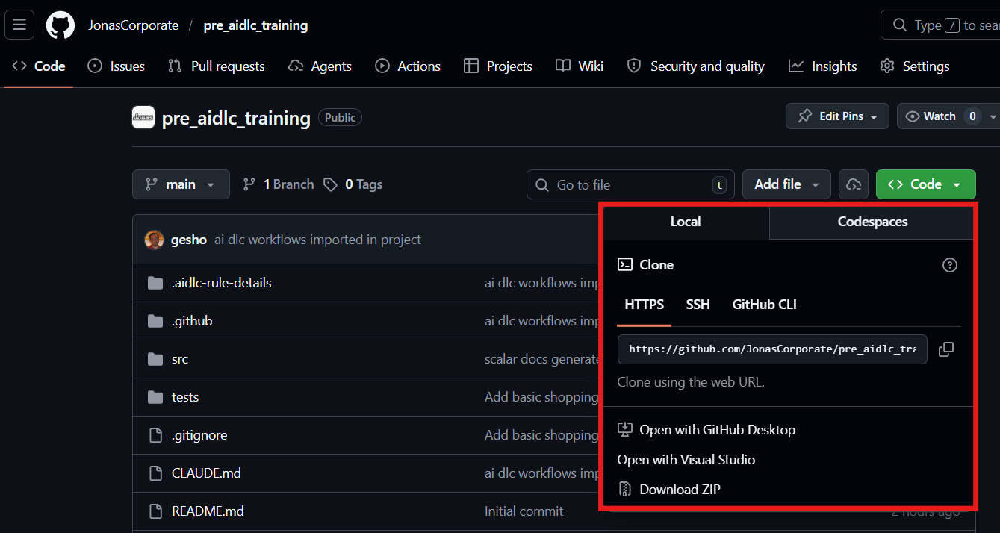

# Pre AWS AI DLC Training

Pre-training exercise for AI DLC workshops.

## 0. Introduction and setup

### Sign-Up Purpose

A purpose of this pre AIDLC training is to do a quick run of a full iteration of the AIDLC process prior to the actual workshop. The application under development is a trivial shopping API under Node/Express. This training will also help with setup on a local laptop, even though prerequisites are minimal. This pre-training may be redundant if you already have experience with the AIDLC process or if you are confident your local setup is already in place.

### Companion video guide

Progression of this process together with some additional insights have been recorded in [a companion video guide](https://jonassoftware-my.sharepoint.com/:f:/p/giorgi_shonia/IgCvYX8RBAngRJs0TtQM1sBRAWtzDBzdlgu0t-TezeKNais?e=s6Jbd0). If you find it helpful, please see video guide before starting respective section, starting from [0: setup](https://jonassoftware-my.sharepoint.com/:v:/p/giorgi_shonia/IQCiM56t03IcRY9N5bTX7ai7AVkxJ5J45cWGDL_IrBlpnZ4?nav=eyJyZWZlcnJhbEluZm8iOnsicmVmZXJyYWxBcHAiOiJPbmVEcml2ZUZvckJ1c2luZXNzIiwicmVmZXJyYWxBcHBQbGF0Zm9ybSI6IldlYiIsInJlZmVycmFsTW9kZSI6InZpZXciLCJyZWZlcnJhbFZpZXciOiJNeUZpbGVzTGlua0NvcHkifX0&e=NdOx7m).

### Prerequisites
- [Node.js](https://nodejs.org/en/download/current) installed on your local machine. This is for sample app, which is a Node/Express API.
- A code editor of your choice (typically [Visual Studio Code](https://code.visualstudio.com/))
- Coding agent. This repo is pre-set for [Claude Code](https://code.claude.com/docs/en/quickstart) and [Copilot CLI](https://github.com/github/copilot-cli?tab=readme-ov-file#installation), though it is possible to use other agents of your choice. This workshop is not token intensive, but would need basic access, paid or trial. 

### References


- [Current repo](https://github.com/JonasCorporate/pre_aidlc_training). Please clone this in a manner of your choice. eg cloning or downloading zip. Once available locally, please open that folder in `VS Code`.  

```bash
git clone https://github.com/JonasCorporate/pre_aidlc_training
```



- [AI DLC Workshop repo](https://github.com/awslabs/aidlc-workflows?tab=readme-ov-file#platform-specific-setup). For the moment you don't have to clone this, but in your future work you will need part of this repo as your setup. The `.aidlc-rule-details` that you see in our project has been copied from this repo. From time to time one can pull fresh version and make sure we are using latest version of the workflow. 
- Various stages of progression will be snapshotted with tags. Present initial stage (which is also `HEAD` of the `main` branch) is for instance tagged as `v0.0-initial`. If at any point you feel your process has diverged, you can always recover either leaning on 
  - Your own version control. Hence frequent commits recommended. or 
  - Using one of our tags. This will put you in the desired state, but obviously lose any customizations peculiar to choices you've made. Reseting to tag can be executed (for instance) by:
  ```powerShell
    git reset --hard v0.0-initial
    ``` 

### Validation gate:

- VS Code running with project open in it. 
- Coding agent launched and on standby. 

Validation and gates is a also a concept extensively used in AI DLC. We'll have validations at various checkpoints, and often they will gate progress. Sometimes this validation will be performed by AI, sometimes by human reviewer. 

## 1. Initiation, Reverse engineering

### 1.1 Video guide (optional)

Watch [1: initiation and reverse engineering](https://jonassoftware-my.sharepoint.com/:v:/p/giorgi_shonia/IQCiM56t03IcRY9N5bTX7ai7AVkxJ5J45cWGDL_IrBlpnZ4?nav=eyJyZWZlcnJhbEluZm8iOnsicmVmZXJyYWxBcHAiOiJPbmVEcml2ZUZvckJ1c2luZXNzIiwicmVmZXJyYWxBcHBQbGF0Zm9ybSI6IldlYiIsInJlZmVycmFsTW9kZSI6InZpZXciLCJyZWZlcnJhbFZpZXciOiJNeUZpbGVzTGlua0NvcHkifX0&e=NdOx7m) video for this section. Among other things is covers `vibe-coding` vs `ai-dlc` distinction. 

### 1.2 (Optional): Review AI DLC platform markdowns

It will help to review the markdowns in the `.aidlc-rule-details` folder. For now in [common](./.aidlc-rule-details/common) folder. Most helpful is `process-overview` (with Mermaid diagram). 